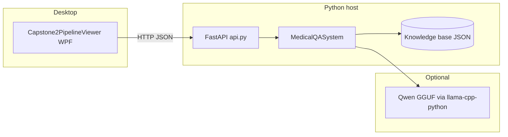
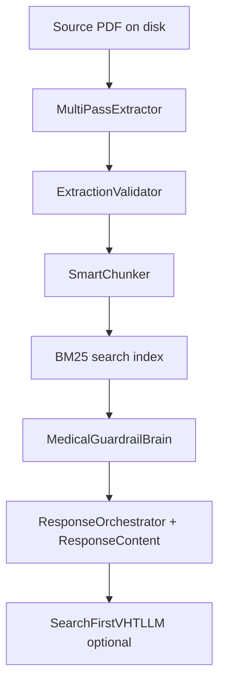
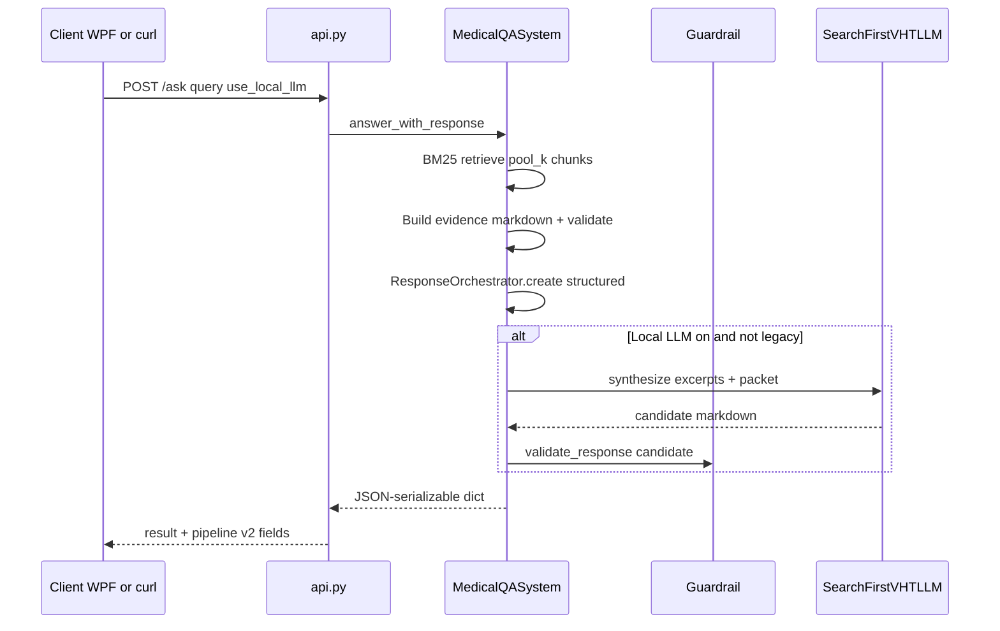
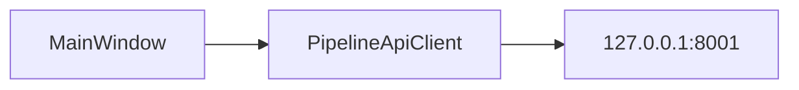

# Architecture — SafeAI Clinical Pipeline v2 (capstone2)

This document describes how the **Python pipeline**, **FastAPI service**, **local LLM (search-first VHT)**, and **Windows WPF client** fit together.

---

## 1. High-level system



| Component | Role |
|-----------|------|
| **`pipeline/`** | Offline/online medical Q&A: PDF → chunks → BM25 index → retrieval → guardrails → VHT formatting → optional local LLM. |
| **`api.py`** | HTTP façade: `/initialize`, `/ask`, `/health`, `/metadata`. Binds to `MedicalQASystem`. |
| **`run_pipeline.py` / `python -m pipeline`** | CLI for extraction and batch workflows (`pipeline.cli`). |
| **`run_ask.py`** | One-shot terminal Q&A after init. |
| **`windows/Capstone2PipelineViewer/`** | WPF app calling the same REST endpoints (default base URL `http://127.0.0.1:8001`). |

---

## 2. Python pipeline — vertical slice

End-to-end flow for a single preset (Uganda **or** WHO malaria PDF):



| Stage | Module(s) | Responsibility |
|-------|-----------|------------------|
| **Config** | `pipeline/config.py` | `ExtractionConfig`, presets, PDF paths, default KB dirs under **this repo** (`kb_uganda_clinical_2023/`, `kb_who_malaria/`). |
| **Extraction** | `pipeline/extractor.py` | Multi-pass PDF text/tables/images. |
| **Validation** | `pipeline/validator.py` | Quality / plausibility signals stored in KB metadata. |
| **Chunking** | `pipeline/chunker.py` | Heading-aware chunks + BM25 index materialization. |
| **Persistence** | `pipeline/orchestrator.py` | Writes `knowledge_base.json`, `chunks.json` under `output_dir`. |
| **Retrieval** | `pipeline/retrieval.py`, `orchestrator._retrieve_top_k` | Tokenize query, BM25 + quality-weighted re-ranking. |
| **Evidence answer** | `orchestrator.answer` | Top chunks stitched + guardrail footer. |
| **Full VHT answer** | `orchestrator.answer_with_response` | Evidence UI + structured layer + optional LLM. |
| **Structured VHT** | `pipeline/response.py` | `ResponseOrchestrator`, `ResponseContent`, rule-based VHT markdown, quick/referral formats. |
| **Guardrails** | `pipeline/guardrail.py` | Section headings, triage consistency, dangerous phrasing, citation page sanity. |
| **Search-first LLM** | `pipeline/search_first_llm.py` | Chat completion: **Evidence** excerpts + approved structured packet → VHT markdown sections. |
| **Legacy LLM path** | `pipeline/local_simplifier.py` | Optional `SAFEAI_VHT_LLM_LEGACY=1`: rewrite rule-based draft + excerpts (v1-style). |

---

## 3. Request path: FastAPI `POST /ask` (full response)



**Key return fields** (among others): `vht_response`, `referral_note`, `quick_summary`, `structured`, `local_llm_used`, `local_llm_skipped_reason`, `vht_synthesis_mode` (`search_first_llm` | `legacy_simplifier` | `rule_based_only`), `vht_retrieval_pool_k`.

---

## 4. Data on disk

| Artifact | Typical location |
|----------|------------------|
| **Chunks + KB** | `{output_dir}/knowledge_base.json`, `chunks.json` |
| **Cache** | `{output_dir}/cache/` (extraction cache) |

Default `output_dir` is **inside capstone2** (see `config.py`) so a second copy of the app does not overwrite v1 KBs next to the PDFs.

**Source PDFs** (unchanged paths in config):

- Uganda: `C:\temp\capstone\Uganda Clinical Guidelines 2023.pdf`
- WHO malaria: `C:\temp\capstone\Bookshelf_NBK588130.pdf`

---

## 5. Environment and tuning

| Variable | Effect |
|----------|--------|
| `SAFEAI_USE_LOCAL_LLM`, `SAFEAI_LLM_GGUF` | Enable GGUF path for `llama-cpp-python` (`local_simplifier._load_llama`). |
| `SAFEAI_V2_RETRIEVAL_K` | BM25 pool size for `answer_with_response` (default **18**). |
| `SAFEAI_VHT_LLM_LEGACY` | When `1`, use `LocalSimplifierLLM.simplify_vht_markdown` instead of search-first. |
| `SAFEAI_SEARCH_FIRST_*` | Chunk/total/user char caps and temperature for `search_first_llm.py`. |
| `SAFEAI_LLM_*` | Threads, context, max tokens, etc. (shared loader). |

---

## 6. Windows desktop client

- **Solution:** `windows/Capstone2PipelineViewer/Capstone2PipelineViewer.sln`
- **Runtime:** .NET 8 WPF (`net8.0-windows`)
- **HTTP:** `HttpClient` → same routes as `api.py` (`/health`, `/initialize`, `/ask`)
- **Settings:** `%LocalAppData%\SafeAICapstone2PipelineViewer\settings.json` (API base URL, GGUF path)



---

## 7. Dependency layers (Python)

```text
api.py / run_ask.py / run_pipeline.py
    └── pipeline.orchestrator.MedicalQASystem
            ├── extractor, validator, chunker
            ├── guardrail
            ├── response (VHT formatting)
            ├── local_simplifier (GGUF loader + legacy simplifier)
            └── search_first_llm (search-first VHT synthesis)
```

**Install surfaces:**

- `requirements-pipeline.txt` — extraction + retrieval stack.
- `requirements-local-llm.txt` — `llama-cpp-python` (optional).
- `requirements-api.txt` — pipeline + FastAPI + uvicorn.

---

## 8. Versioning note

This tree is **pipeline v2**: search-first LLM is the default synthesis path for `answer_with_response` unless `SAFEAI_VHT_LLM_LEGACY=1`. The original **safeai-purdue-capstone** repo remains the reference for v1 behavior and shared clinical logic patterns.
