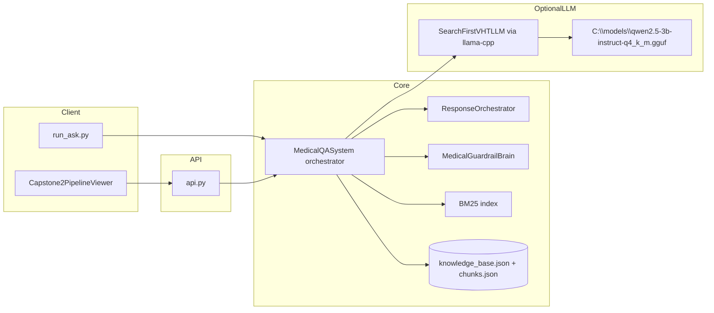
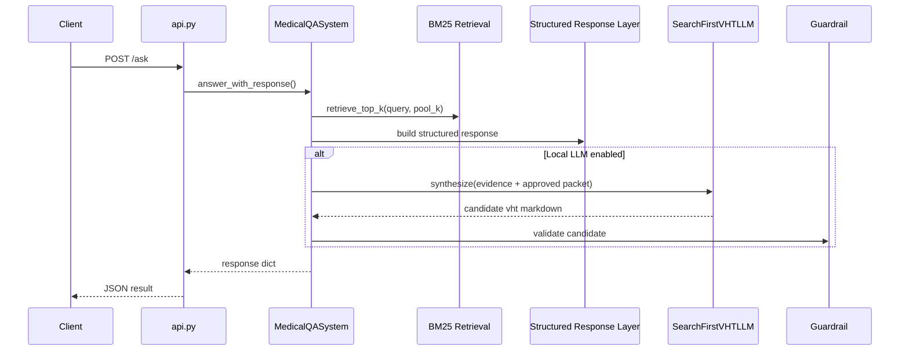

# Title

SafeAI Medical Brain v2 (capstone2): Offline Clinical Guidance Pipeline with Search-First Local LLM for VHT Decision Support

---

# UseCase

The system supports frontline community and primary-care workflows where internet may be unreliable and guidance must remain grounded in validated clinical references.

Primary use cases:

- Triage-oriented question answering for Village Health Team (VHT) workers.
- Rapid referral decision support for danger signs and severe malaria contexts.
- Retrieval-grounded summarization from approved guideline sources.
- Standardized API access for desktop and integration clients.

Target scenarios:

- Uganda community healthcare workflows.
- Malaria-focused and broad clinical guideline lookups.
- Local/offline deployments where model and guideline files are available on disk.

---

# Functional and Technical Requirement

## Functional Requirement

1. The system shall ingest and process two source documents:
   - `C:\temp\capstone\Uganda Clinical Guidelines 2023.pdf`
   - `C:\temp\capstone\Bookshelf_NBK588130.pdf`
2. The system shall create and persist a searchable knowledge base (KB).
3. The system shall expose HTTP endpoints for health, initialization, metadata, and ask.
4. The system shall produce triage-aware VHT output with required safety sections.
5. The system shall optionally use a local GGUF LLM:
   - `C:\models\qwen2.5-3b-instruct-q4_k_m.gguf`
6. The system shall validate generated output with a medical guardrail before final acceptance.
7. The system shall support a Windows desktop prototype app for non-technical usage.

## Technical Requirement

- Python runtime with dependencies from:
  - `requirements-pipeline.txt`
  - `requirements-local-llm.txt` (optional)
  - `requirements-api.txt`
- FastAPI + Uvicorn host:
  - `python -m uvicorn api:app --host 0.0.0.0 --port 8001`
- Local GGUF runtime:
  - `llama-cpp-python`
- .NET 8 WPF for prototype desktop app:
  - `windows/Capstone2PipelineViewer/`

Non-functional requirements:

- Deterministic rule-based fallback when LLM unavailable or rejected.
- Output explainability via citations and structured response fields.
- Local-only operation capability once dependencies and files are present.

---

# Solution Overview

The medical brain has three major planes:

1. **Knowledge plane**  
   PDF extraction, validation, chunking, and BM25 indexing.
2. **Reasoning/response plane**  
   Triage inference, evidence rendering, response structuring, guardrails, and optional LLM synthesis.
3. **Delivery plane**  
   FastAPI endpoints and WPF desktop client.

Key implementation modules:

- `pipeline/orchestrator.py`: pipeline lifecycle and answer orchestration.
- `pipeline/response.py`: structured response content and formatting.
- `pipeline/guardrail.py`: safety checks on final output.
- `pipeline/search_first_llm.py`: search-first LLM synthesis path.
- `api.py`: REST entry point.

---

# archiecture

## Component architecture



## Runtime sequence for `POST /ask`



---

# the training data sources

This system does not perform model training in this repository. It performs **retrieval-grounded generation** over fixed guideline sources.

Authoritative sources:

1. Uganda Clinical Guidelines 2023  
   Path: `C:\temp\capstone\Uganda Clinical Guidelines 2023.pdf`
2. WHO Malaria Guidelines (NCBI Bookshelf, NBK588130)  
   Path: `C:\temp\capstone\Bookshelf_NBK588130.pdf`

Model source:

- Local inference model file used at runtime:
  - `C:\models\qwen2.5-3b-instruct-q4_k_m.gguf`

Grounding policy:

- Clinical specifics must be supported by retrieved evidence and structured constraints.
- Guardrail validation gate decides whether an LLM output is accepted.

---

# the complete offline pipeline documentation

## 1) Configuration and source selection

- Module: `pipeline/config.py`
- Presets:
  - `who-malaria`
  - `uganda`
- Defaults:
  - WHO PDF: `C:\temp\capstone\Bookshelf_NBK588130.pdf`
  - Uganda PDF: `C:\temp\capstone\Uganda Clinical Guidelines 2023.pdf`
- Default KB output dirs under this repo:
  - `kb_who_malaria/`
  - `kb_uganda_clinical_2023/`

## 2) Extraction

- Module: `pipeline/extractor.py`
- Method: multi-pass extraction of text/tables/images.
- Output held in memory as `extraction_result`.

## 3) Validation

- Module: `pipeline/validator.py`
- Produces quality and plausibility reports (`validation_result`).

## 4) Chunking and search index

- Module: `pipeline/chunker.py`
- Produces semantic/heading chunks.
- Builds BM25 index used by retrieval.

## 5) Persistence

- `knowledge_base.json`
- `chunks.json`
- cache directory under output dir.

## 6) Retrieval and evidence assembly

- Modules:
  - `pipeline/retrieval.py`
  - `pipeline/orchestrator.py`
- Retrieval pool:
  - `SAFEAI_V2_RETRIEVAL_K` (default `18`)
- Evidence shown to users:
  - top 5 sources in `result.sources`

## 7) Triage and structured response

- Module: `pipeline/response.py`
- Builds `ResponseContent`:
  - triage
  - actions
  - monitoring
  - referral criteria
  - citations
  - confidence score

## 8) Guardrails

- Module: `pipeline/guardrail.py`
- Checks:
  - required section headings
  - triage consistency
  - dangerous advice patterns
  - citation sanity

## 9) Local LLM synthesis (optional)

### Default path (v2)

- Module: `pipeline/search_first_llm.py`
- Strategy: **search-first**
  - Prompt contains approved structured packet + numbered evidence excerpts.
  - Model must output required section headings.

### Legacy path (v1-style)

- Module: `pipeline/local_simplifier.py`
- Enabled with `SAFEAI_VHT_LLM_LEGACY=1`.

## 10) Acceptance gate

- If local LLM output passes guardrail, it becomes `vht_response`.
- Otherwise the system falls back to rule-based VHT response.

## 11) API delivery

- Module: `api.py`
- Endpoints:
  - `GET /`
  - `GET /health`
  - `GET /metadata`
  - `POST /initialize`
  - `POST /ask`

---

# Prototype app

Windows app location:

- `windows/Capstone2PipelineViewer/Capstone2PipelineViewer.sln`

Purpose:

- Call `/health`, `/initialize`, and `/ask`.
- Select source preset and predefined test query.
- Optionally pass local GGUF path in ask request.

Prototype screenshot:


If your Markdown renderer cannot load the absolute path above, open the image directly at:

- `C:\Users\finadmin\.cursor\projects\c-temp-capstone2\assets\c__Users_finadmin_AppData_Roaming_Cursor_User_workspaceStorage_e283966b997c66fe5b72fdf730836cf3_images_image-f3194e1b-2d1d-4972-9003-29d812d91278.png`

---

# Output JSON field documentation (for request query)

Below is the output contract for the sample request:

```json
{
  "query": "When to refer a patient with malaria to hospital?",
  "full_response": true,
  "pipeline": "v2",
  "result": { }
}
```

## Root response fields

| Field | Type | Description |
|---|---|---|
| `query` | `string` | Echo of the input request query at API level. |
| `full_response` | `boolean` | Echo of request mode (`true` means full VHT response package). |
| `pipeline` | `string` | Pipeline version marker from API (`"v2"`). |
| `result` | `object` | Full answer payload generated by orchestrator. |

## `result` object fields

| Field | Type | Description |
|---|---|---|
| `query` | `string` | Query passed to orchestration layer. |
| `query_intent` | `string` | Lightweight intent classification (`general`, `dosing`, `referral_hospital`). |
| `response` | `string` (markdown) | Evidence bundle with top excerpts, triage footer, and guardrail status text. |
| `sources` | `array<object>` | Top evidence snippets shown to user. |
| `validation` | `object` | Guardrail output for the evidence response bundle. |
| `validation_passed` | `boolean` | Convenience mirror of `validation.passed`. |
| `triage` | `string` | Final triage level enum name (`RED`, `YELLOW`, `GREEN`). |
| `triage_reasons` | `array<string>` | Reasons used to justify triage level. |
| `vht_response` | `string` | Final VHT markdown (LLM output if accepted; otherwise rule-based fallback). |
| `referral_note` | `string` | Compact referral note format for handoff workflow. |
| `quick_summary` | `string` | One-screen quick recommendation summary. |
| `structured` | `object` | Serialized `ResponseContent` object used as canonical intermediate representation. |
| `local_llm_used` | `boolean` | `true` if LLM output was accepted by guardrail. |
| `local_llm_skipped_reason` | `string \| null` | Reason for no LLM output or rejection. |
| `vht_synthesis_mode` | `string` | Synthesis path used: `search_first_llm`, `legacy_simplifier`, or `rule_based_only`. |
| `vht_retrieval_pool_k` | `integer` | Retrieval pool size used before evidence selection. |

## `result.sources[]` fields

| Field | Type | Description |
|---|---|---|
| `page` | `integer` | Source document page number for the chunk. |
| `heading` | `string` | Section heading/title for that retrieved chunk. |

## `result.validation` fields

| Field | Type | Description |
|---|---|---|
| `passed` | `boolean` | True if guardrail checks passed. |
| `warnings` | `array<string>` | Non-blocking issues found by guardrail. |
| `errors` | `array<string>` | Blocking issues found by guardrail. |
| `suggestions` | `array<string>` | Optional improvement suggestions from guardrail. |

## `result.structured` fields

| Field | Type | Description |
|---|---|---|
| `query` | `string` | Query in structured response object. |
| `triage` | `string` | Structured triage enum name. |
| `triage_reasons` | `array<string>` | Reasons for structured triage assignment. |
| `actions` | `array<string>` | Evidence-grounded immediate actions. |
| `monitoring` | `array<string>` | Monitoring/follow-up lines mined from evidence. |
| `referral_criteria` | `array<string>` | Referral criteria and referral-relevant excerpts. |
| `citations` | `array<object>` | Source references supporting the response. |
| `medication_dosage` | `object \| null` | Optional dosage structure (null in current sample). |
| `family_message` | `string \| null` | Family-facing explanation sentence. |
| `danger_signs` | `array<string>` | Structured danger signs (if identified). |
| `validation_warnings` | `array<string>` | Guardrail warnings propagated into structured output. |
| `confidence_score` | `number` | Heuristic confidence score for structured response. |

## `result.structured.citations[]` fields

| Field | Type | Description |
|---|---|---|
| `source` | `string` | Canonical source label (e.g., WHO Malaria Guidelines). |
| `page` | `integer` | Cited page number from retrieved chunk. |
| `section` | `string` | Cited section heading/title. |

## Notes on your sample response quality

- The payload structure is valid and complete for v2.
- `local_llm_used: true` indicates the generated `vht_response` passed guardrail checks.
- Content quality can still vary by retrieval relevance; this is why both:
  - `response` (retrieval evidence block) and
  - `structured` (canonical intermediate state)
  are returned for auditability.

---

# Operational checklist

1. Start API:
   - `python -m uvicorn api:app --host 0.0.0.0 --port 8001`
2. Initialize selected preset once:
   - `POST /initialize`
3. Ask questions:
   - `POST /ask`
4. For local LLM:
   - Ensure GGUF exists at `C:\models\qwen2.5-3b-instruct-q4_k_m.gguf`
   - Set `SAFEAI_USE_LOCAL_LLM=1` or pass `use_local_llm=true`.

